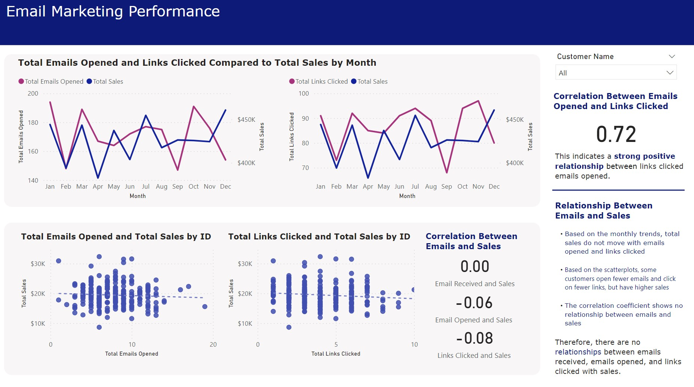

# ✉ Email Marketing Dashboard

 
 

## Introduction
I analyzed a fictitious email marketing dataset from Enterprise DNA. The dataset was an excel file with 2 sheets about emails and sales of a company. One sheet included customer data, products each customer bought, and sales. The other sheet had data of emails sent to each customer and whether the customer received it, opened it, and clicked on the link in the email. The goal of this analysis was to discover the relationship between emails and sales. **I used Power BI for this analysis.**

## Analysis
First, I analyzed the overview of the email campaign. There were 8,368 emails sent, but only about half of it was received and half of the emails received were read. The overall email open rate is 24.5%, while the CTR rate is 12.4%. 

The emails were sent to 263 customers. Among these customers, Johnny Butler was sent the most emails, Dennis Morris received the most emails, while Bruce Harris opened the most emails. However, Dennis Morris clicked on the most links. During this email campaign, sales of $5,114,683 were generated, with Justin Butler contributing to the most sales. Bruce Harris and Dennis Morris did not generate the most sales despite opening the most emails or clicking on the most links. This suggests the lack of relationship between emails and sales.

Second, I analyzed the monthly trends of emails opened, links clicked, and sales. Based on the line charts, the number of emails opened and links clicked do not move in the same direction with sales for all of the months, suggesting a low relationship with sales.

Third, I calculated the correlation between the variables.
- There is a correlation coefficient of 0.72 between emails opened and links clicked, suggesting a strong positive relationship between the 2 variables.
- The correlation coefficient of 0.00 between emails received and sales suggests no relationship between the 2 variables.
- The correlation coefficient of -0.06 between emails opened and sales suggests no relationship between the 2 variables.
- The correlation coefficient of -0.08 between links clicked and sales suggests no relationship between the 2 variables.

In conclusion, there is no relationship between emails and sales. Receiving more emails, opening more emails, or clicking on more links in the emails do not imply with higher sales. Therefore, the company is recommended to change its email marketing campaign to improve conversion.
